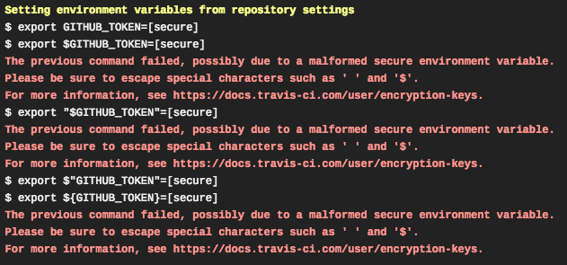

Title: Automating-Pelican-Travis-CI
Date: 2018-09-11 13:20
Category: Notes

# Automating Pelican builds with Travis-CI

Make sure to escape special characters for bash. The format $"GITHUB_TOKEN" is appropriate for this case.

I referred to [the official Travis-CI documentation](https://docs.travis-ci.com/user/deployment/pages/), [this tutorial](https://blog.minchin.ca/2017/05/deploying-pelican-with-travis-to-github.html) from user MinchinWeb, and his [corresponding source repo](https://github.com/MinchinWeb/blog.minchin.ca) to navigate this process.
